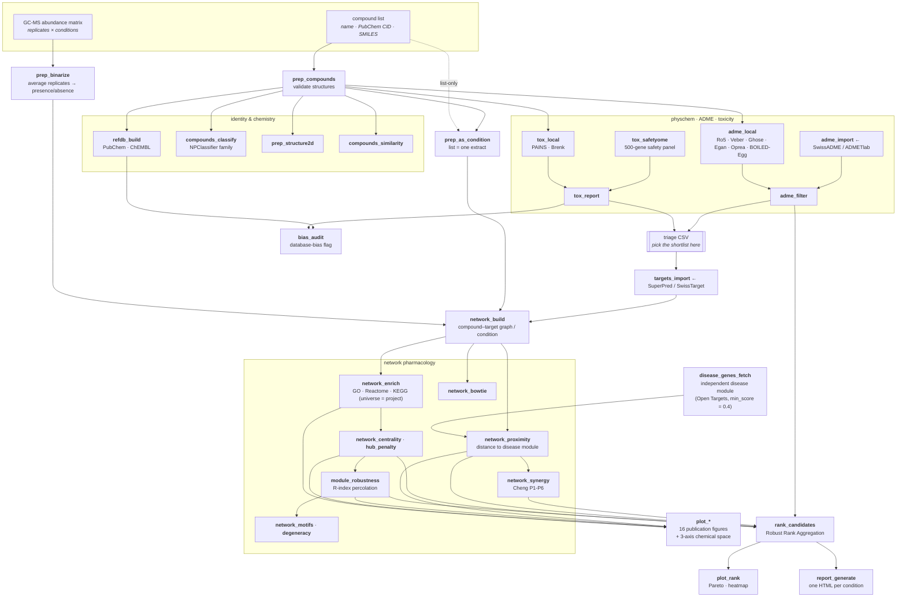

# patliR


**Reproducible network-pharmacology analysis for natural-product extracts.**
From a plain compound list (or a GC-MS abundance matrix) all the way to a
fully-logged compound–target–pathway network — every step a pure function,
every intermediate a plain CSV.

Developed at the Laboratorio de Investigación Química y Farmacológica de
Productos Naturales, UAQ.

---

## The pipeline



Two entry points: a **curated compound list** (`prep_compounds`) or a **raw
abundance matrix** (`prep_binarize`). Everything downstream is shared. The
network layer keys off one graph per experimental *condition*; with a plain
list, `prep_as_condition()` makes the whole list a single condition.

## Install

```r
# install.packages("remotes")
remotes::install_github("hierax00/patliR")
```

Java (≥ 8) is required for the `rcdk`/`rJava` cheminformatics routines
(structure validation, PAINS/Brenk matching, descriptors). Everything else
is optional and pulled in only when you call a function that needs it —
Bioconductor packages for `network_enrich()` / `tox_safetyome()` /
`network_pathview()`, `STRINGdb` for `network_proximity()` / `network_bowtie()`,
`plotly` for the 3-D chemical space, and so on. Each help page lists its own
requirements.

## Quick start — list to triage table

```r
library(patliR)

proj <- patliR_project("chilcuague")
compounds_in <- read.csv("compounds.csv")          # name, CAS, PubChemCID, SMILES

proj <- prep_compounds(proj, compounds_in, identifier = "smiles")
proj <- refdb_build(proj, sources = c("pubchem", "chembl"))   # reference DB, on load
proj <- compounds_classify(proj)                    # natural-product family
proj <- adme_local(proj)                            # drug-likeness rules + BOILED-Egg
proj <- adme_filter(proj, rules = c("ro5", "veber", "ghose", "egan", "oprea"))
proj <- tox_local(proj, alert_sets = c("pains", "brenk"))

report <- tox_report(proj)                          # → results/tox_report.csv
report$summary                                      # one row per compound
```

## Quick start — shortlist to network

```r
keep <- c("C0001", "C0004", "C0009", "C0021")       # your picks from the triage

proj <- prep_as_condition(proj, condition = "Chilcuague", compound_ids = keep)
proj <- targets_import_batch(proj, "targets_superpred/", platform = "superpred")
proj <- network_build(proj)
proj <- network_enrich(proj, condition = "Chilcuague", db = "go")
proj <- network_centrality(proj, condition = "Chilcuague")
proj <- network_module_robustness(proj, condition = "Chilcuague", seed = 42)

plot_network_layers(proj, condition = "Chilcuague")
plot_chemical_space(proj, dims = 3, color_by = "family", engine = "plotly")

## close the loop: one ranked table + one report, combining everything above
proj <- rank_candidates(proj, condition = "Chilcuague", export = "sdf")
plot_rank(proj, condition = "Chilcuague", view = "pareto")
proj <- report_generate(proj, condition = "Chilcuague")
```

A worked end-to-end script against a real dataset lives in
[`chilcuague-analysis/`](https://github.com/hierax00/chilcuague-analysis).

## Function families

| family | what it does |
|---|---|
| `prep_*` | import & validate compounds, binarize an abundance matrix, 2-D depiction, list-as-condition |
| `refdb_*` | local reference DB of identity + bioactivity (PubChem, ChEMBL) |
| `compounds_classify()` / `compounds_similarity()` | NPClassifier family; pairwise fingerprint similarity |
| `adme_*` | local drug-/lead-likeness rules + BOILED-Egg; import from external platforms; rule filtering; SMILES export bridge |
| `tox_*` | PAINS/Brenk structural alerts; target-level safety panel; import; per-compound report — **never a pass/fail verdict** |
| `targets_*` | import predicted targets; disease-association filtering (Open Targets) |
| `disease_genes_*` | independent disease gene module for `network_proximity()` (Open Targets, or a curated import) |
| `network_*` | build, enrich, centrality/hub-penalty, module robustness, motifs, degeneracy, proximity, synergy, bow-tie, KEGG pathview, proteome filter |
| `plot_*` | 16 static/interactive figures for every result above |
| `bias_*` | MAD-based "promiscuous compound/target" flag against the reference DB |
| `rank_candidates()` / `plot_rank()` | Robust Rank Aggregation over ADME + network criteria into one ranked table, with Pareto/heatmap views |
| `report_generate()` | one self-contained HTML report per condition |
| `patliR_export_llm()` | flat-text dump of a whole project for an LLM to read |

Everything is documented on its own help page.
[`METHODS.md`](METHODS.md) explains, in plain language, what each function
actually computes and the theory behind it. For the cross-cutting design
decisions see [`DESIGN.md`](DESIGN.md); for what is designed but not yet
built see [`ROADMAP.md`](ROADMAP.md).

## Design in one paragraph

Every step is a pure transformation `proj <- step(proj, ...)`. `proj` is an
immutable S4 object, but the durable source of truth is always a plain CSV
in the project directory — `patliR_load()` rebuilds the whole project from
those CSVs in a fresh R session, on another machine, with no R-specific
binary format. Every step appends to a run log, so every filtering
decision, random seed, and data source is traceable after the fact.
External services (PubChem, ChEMBL, KEGG, STRING, …) all go through one
retry/cache wrapper and never break the pipeline when they fail.

## Bundled reference data

Small curated tables ship under `inst/extdata/` so the local steps work
offline:

- **PAINS** — 480 filters, Baell & Holloway (2010), *J. Med. Chem.* 53(7),
  2719–2740; verbatim from RDKit's `wehi_pains.csv` (BSD-3-Clause).
- **Brenk** — 105 alerts, Brenk et al. (2008), *ChemMedChem* 3, 435–444;
  from PatWalters/rd_filters (MIT), cross-checked against RDKit's
  `FilterCatalogs.BRENK`.
- **Safetyome core panel** — 500 genes, Liu et al. (2026), *Toxicological
  Sciences* 209(3), kfag021, Supplementary Table 4. Redistribution terms
  for that table were not independently confirmed at the time of writing.
- **BOILED-Egg** GIA/BBB ellipse boundaries — digitized from Daina & Zoete
  (2016) via PyBOILEDegg (GPL-3).

## License

MIT — see [`LICENSE`](LICENSE).
