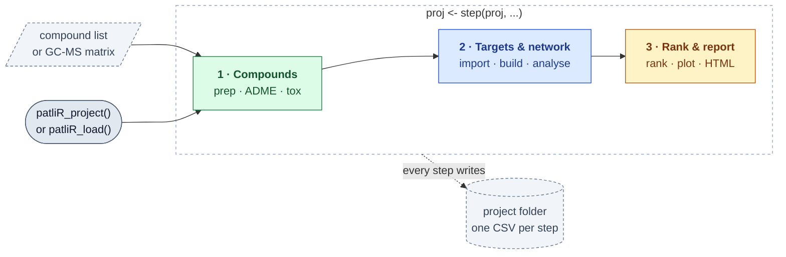
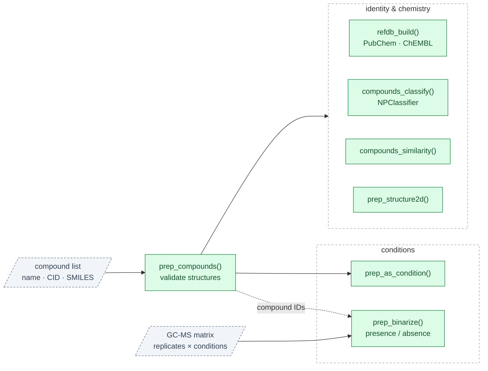
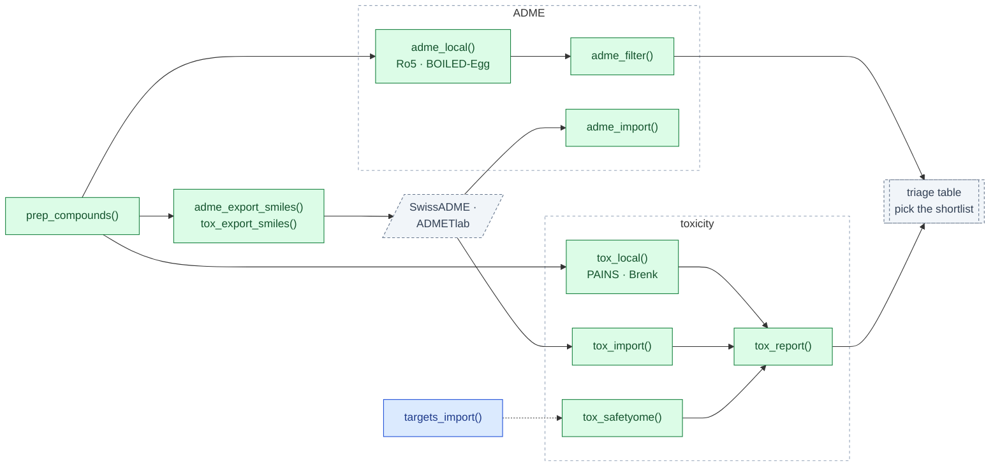
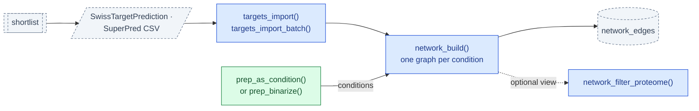
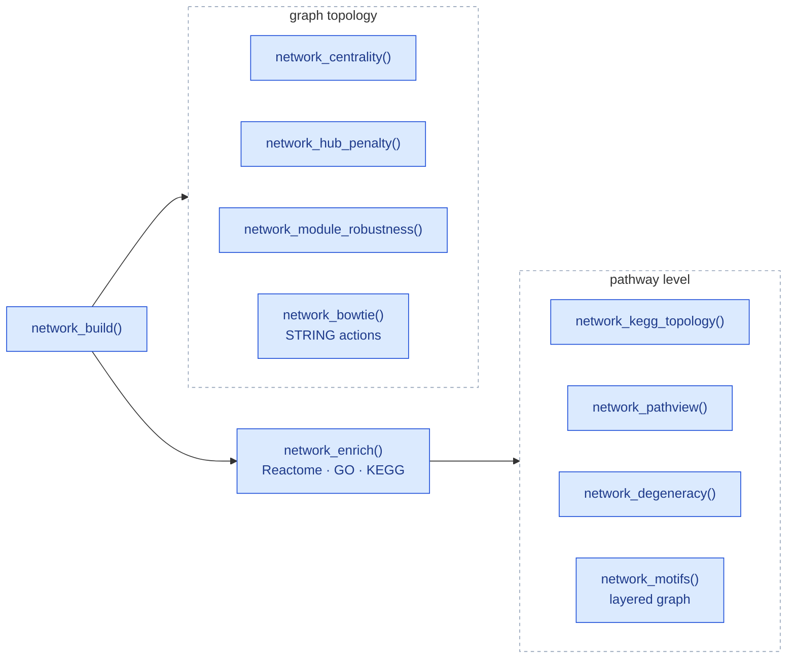
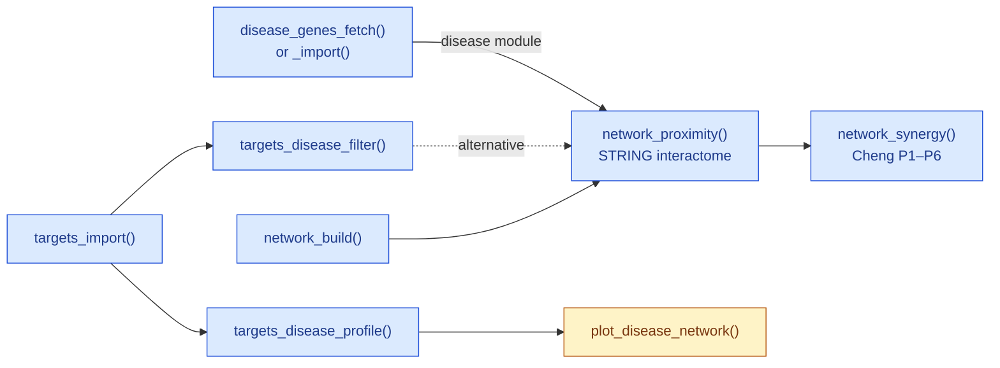
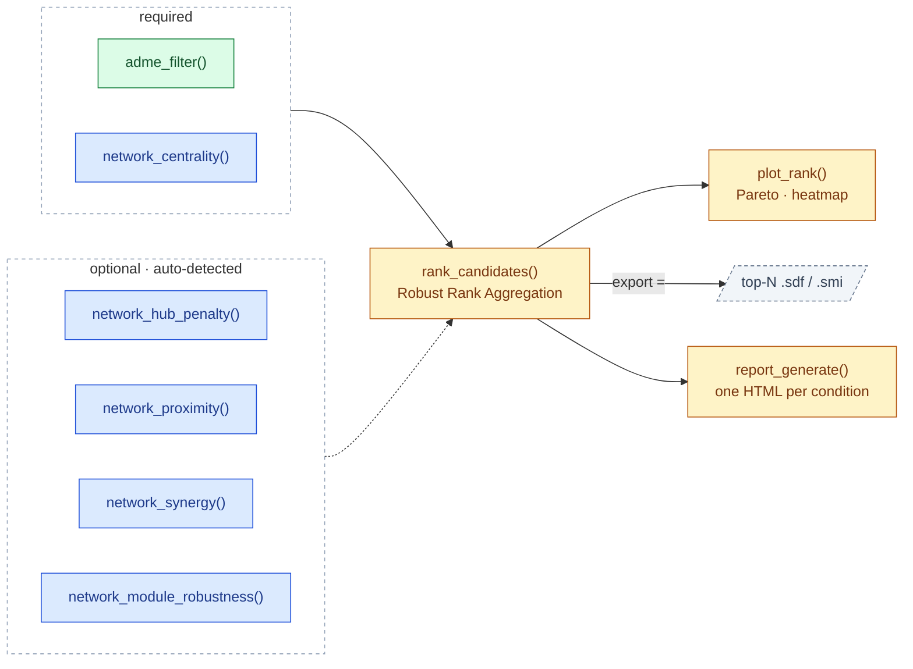
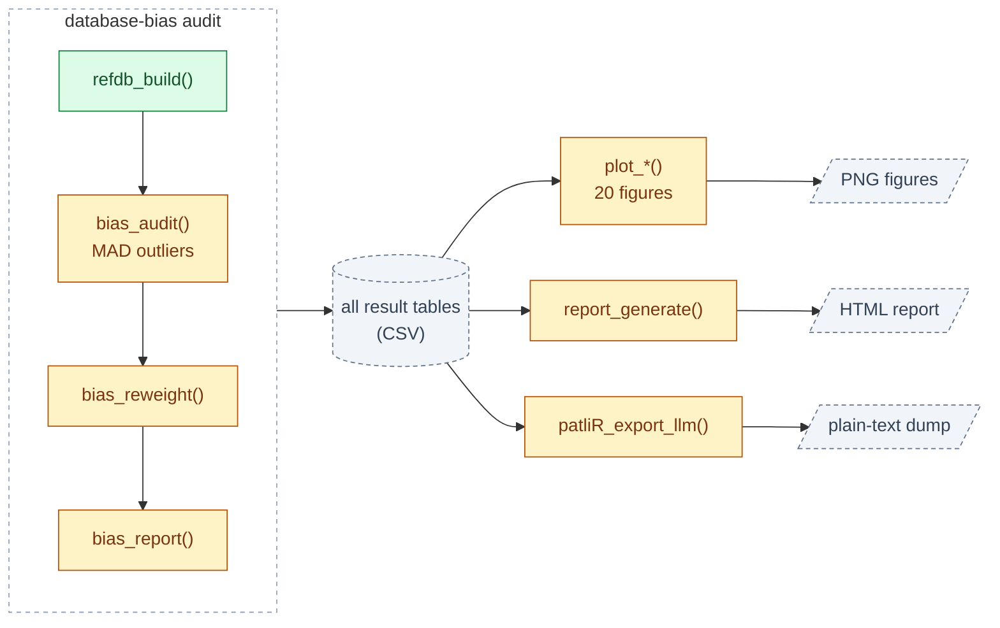

# patliR


**Reproducible network-pharmacology analysis for natural-product extracts.**
From a plain compound list (or a GC-MS abundance matrix) all the way to a
fully-logged compound–target–pathway network — every step a pure function,
every intermediate a plain CSV.

Developed at the Laboratorio de Investigación Química y Farmacológica de
Productos Naturales, UAQ.

---

## The pipeline

Three stages, each a short chain of pure functions. Two entry points feed
stage 1: a **curated compound list** (`prep_compounds`) or a **raw abundance
matrix** (`prep_binarize`). Everything downstream is shared. The network
layer keys off one graph per experimental *condition*; with a plain list,
`prep_as_condition()` makes the whole list a single condition.

### Overview

*Every step is `proj <- step(proj, ...)`: it returns a new project object
and writes its result as a CSV, so `patliR_load()` can resume from disk.*



### 1. Compounds to triage

*1a · Entry points, conditions and compound identity.*



*1b · ADME and toxicity triage. `tox_safetyome()` screens predicted
targets, so it runs once stage 2's `targets_import()` has.*



### 2. Targets to network

*2a · Predicted targets become one compound–target graph per condition.*



*2b · Analyses on the built graph; the pathway-level ones need
`network_enrich()` first.*



*2c · Disease context: proximity to an independent disease module, then
pairwise synergy.*



### 3. Ranking, bias audit & report

*3a · `rank_candidates()` needs ADME and centrality; the other criteria
are used when present.*



*3b · Database-bias audit, figures and exports, all read from the
project's result tables.*



## Install

```r
# install.packages("remotes")
remotes::install_github("hierax00/patliR")
```

Java (≥ 8) is required for the `rcdk`/`rJava` cheminformatics routines
(structure validation, PAINS/Brenk matching, descriptors). Everything else
is optional (`Suggests`) and needed only when you call a function that uses
it — Bioconductor packages (install with `BiocManager::install()`) for
`network_enrich()` / `tox_safetyome()` / `network_pathview()`, `STRINGdb` for
`network_proximity()` / `network_synergy()` / `network_bowtie()` /
`plot_target_chord()`, `plotly` for the 3-D chemical space, `shiny` for
`launch_app()`, and so on. Each help page lists its own requirements.

## Quick start — list to triage table

```r
library(patliR)

proj <- patliR_project("chilcuague")
compounds_in <- read.csv("compounds.csv")          # name, CAS, PubChemCID, SMILES

proj <- prep_compounds(proj, compounds_in, identifier = "smiles")
proj <- refdb_build(proj, sources = c("pubchem", "chembl"))   # local reference DB
proj <- compounds_classify(proj)                    # natural-product family
proj <- adme_local(proj)                            # drug-likeness rules + BOILED-Egg
proj <- adme_filter(proj, rules = c("ro5", "veber", "ghose", "egan", "oprea"))
proj <- tox_local(proj, alert_sets = c("pains", "brenk"))

report <- tox_report(proj)                          # → results/tox_report.csv
report$summary                                      # one row per compound with results
```

## Quick start — shortlist to network

```r
keep <- c("C0001", "C0004", "C0009", "C0021")       # your picks from the triage

proj <- prep_as_condition(proj, condition = "Chilcuague", compound_ids = keep)
proj <- targets_import_batch(proj, "targets_superpred/", platform = "superpred")
proj <- network_build(proj)
proj <- network_enrich(proj, condition = "Chilcuague", db = "go")
proj <- network_centrality(proj, condition = "Chilcuague")
proj <- network_module_robustness(proj, condition = "Chilcuague", seed = 42)

plot_network_layers(proj, condition = "Chilcuague")  # figures go to <project>/plots/
plot_chemical_space(proj, dims = 3, color_by = "family", engine = "plotly")

## close the loop: one ranked table + one report, combining everything above
proj <- rank_candidates(proj, condition = "Chilcuague", export = "sdf")
plot_rank(proj, condition = "Chilcuague", view = "pareto")
proj <- report_generate(proj, condition = "Chilcuague")  # → reports/report_Chilcuague.html
```

A worked end-to-end script against a real dataset lives in
[`chilcuague-analysis/`](https://github.com/hierax00/chilcuague-analysis).

## Function families

| family | what it does |
|---|---|
| `prep_*` | import & validate compounds (a table or a single row), binarize an abundance matrix, 2-D depiction, list-as-condition |
| `refdb_*` | local reference DB of identity + bioactivity (PubChem, ChEMBL) |
| `compounds_classify()` / `compounds_similarity()` | NPClassifier family; pairwise fingerprint similarity |
| `adme_*` | local drug-/lead-likeness rules + BOILED-Egg; import from external platforms; rule filtering; SMILES export bridge |
| `tox_*` | PAINS/Brenk structural alerts; target-level safety panel; import; per-compound report — **never a pass/fail verdict** |
| `targets_*` | import predicted targets; disease-association filtering (Open Targets) |
| `disease_genes_*` | independent disease gene module for `network_proximity()` (Open Targets, or a curated import) |
| `targets_disease_profile()` / `plot_disease_network()` | every target's Open Targets disease landscape (one named disease, or each target's top-N); compound-target-disease network with disease nodes as hulled blocks |
| `network_*` | build, enrich, centrality/hub-penalty, module robustness, motifs, degeneracy, proximity, synergy, bow-tie, KEGG pathview + directed KEGG topology, proteome filter |
| `plot_*` | 20 static/interactive figures for every result above |
| `bias_*` | MAD-based "promiscuous compound/target" flag against the reference DB, log-ratio re-weighting, summary |
| `rank_candidates()` / `plot_rank()` | Robust Rank Aggregation over ADME + network criteria into one ranked table, with Pareto/heatmap views |
| `report_generate()` | one self-contained HTML report per condition |
| `patliR_project()` / `patliR_load()` / accessors | create or reload a project; read its tables (`compounds()`, `binarizedMatrix()`, `patliRResults()`, `projectLog()`, …) |
| `patliR_export_llm()` | flat-text dump of a whole project for an LLM to read |
| `launch_app()` | optional Shiny wizard that drives the same exported functions |

Everything is documented on its own help page.
[`METHODS.md`](METHODS.md) explains, in plain language, what each function
actually computes and the theory behind it. For the cross-cutting design
decisions see [`DESIGN.md`](DESIGN.md); for what is designed but not yet
built see [`ROADMAP.md`](ROADMAP.md).

## Command reference

Every exported function with its configurable parameters (defaults shown).
`proj` is always the `PatliRProject` object returned by the previous step.

```r
# prep_*
prep_compounds(proj, data, identifier = c("pubchem", "smiles"), id_col = NULL,
                name_col = NULL, dedup = TRUE,
                on_missing_smiles = c("abort", "fetch", "drop"),
                fetch_mode = c("warn_and_cache", "abort"))
prep_compound(proj, data_row, ...)       # one compound; same arguments as prep_compounds()
prep_binarize(proj, data, id_col = "Name", average_replicates = TRUE, q = 0.25)
                                          # q-quantile threshold computed over all compounds
prep_as_condition(proj, condition = "all", compound_ids = NULL)
prep_structure2d(proj, engine = "rcdk", out_dir = NULL)   # "chemminer" is rejected

# refdb_*
refdb_build(proj, sources = c("pubchem", "chembl"), compound_ids = NULL,
            fetch_mode = c("warn_and_cache", "abort"))
refdb_update(proj, compound_ids, sources = c("pubchem", "chembl"),
             fetch_mode = c("warn_and_cache", "abort"))
refdb_rebuild_cache(proj)

# compounds_*
compounds_classify(proj, compound_ids = NULL,
                    fetch_mode = c("warn_and_cache", "abort"))
compounds_similarity(proj, compound_ids = NULL,
                      fingerprint_type = c("standard", "extended", "circular",
                                            "maccs", "pubchem"),
                      method = c("tanimoto", "dice", "cosine"))

# adme_*
adme_local(proj, compound_ids = NULL,
           routes = c("oral", "topical", "ophthalmic", "injectable"))
adme_filter(proj, rules = c("ro5", "veber", "ghose", "egan", "oprea", "route"),
            source = c("local", "imported"), hard_cutoff = FALSE,
            ask = interactive())
adme_import(proj, path, platform = c("swissadme", "admetlab", "other"),
            column_map = NULL, mapping_file = NULL)
adme_export_smiles(proj, compound_ids = NULL, out_file = NULL)

# tox_*
tox_local(proj, compound_ids = NULL, alert_sets = c("pains", "brenk"))
tox_safetyome(proj, compound_ids = NULL)
tox_import(proj, path, platform = c("admetlab", "swissadme", "other"),
           column_map = NULL, mapping_file = NULL)
tox_export_smiles(proj, compound_ids = NULL, out_file = NULL)
tox_report(proj)

# targets_* / disease_genes_*
targets_import(proj, path,
                platform = c("swisstargetprediction", "superpred", "other"),
                target_col = NULL, probability_col = NULL,
                confidence_col = NULL, id_from = c("filename", "column"),
                compound_col = NULL)
targets_import_batch(proj, dir,
                      platform = c("swisstargetprediction", "superpred", "other"),
                      target_col = NULL, probability_col = NULL,
                      confidence_col = NULL)
targets_disease_filter(proj, disease, source = c("open_targets"),
                        min_score = NULL,
                        fetch_mode = c("warn_and_cache", "abort"))
targets_disease_profile(proj, disease = NULL, top_n_diseases = 5,
                         source = c("open_targets"), min_score = NULL,
                         fetch_mode = c("warn_and_cache", "abort"))
disease_genes_fetch(proj, disease, source = c("open_targets"),
                     min_score = 0.4,
                     fetch_mode = c("warn_and_cache", "abort"))
disease_genes_import(proj, table, disease_id, disease_name = NULL,
                      source = "manual", uniprot_col = NULL,
                      gene_symbol_col = NULL, score_col = NULL,
                      map_symbols = FALSE)

# network_*
network_build(proj, condition = NULL,
              target_source = c("imported", "consensus", "bipartite"),
              min_score = NULL)
network_enrich(proj, condition = NULL, db = c("reactome", "go", "kegg"),
               ont = c("BP", "MF", "CC", "ALL"),
               universe = c("project", "genome"), pvalueCutoff = 0.05,
               qvalueCutoff = 0.2, pAdjustMethod = "BH",
               simplify_go = TRUE, simplify_cutoff = 0.7)
network_centrality(proj, condition = NULL,
                    measures = c("degree", "betweenness", "hub_score"),
                    normalize = TRUE)
network_hub_penalty(proj, condition = NULL)
network_module_robustness(proj, condition = NULL,
                           clustering = c("leiden", "bipartite", "hdbscan"),
                           attack = c("targeted", "random", "both"),
                           resolution = 1, n_iterations = 5L,
                           min_module_size = 2, min_component_size = 3L,
                           n_random = 20L, seed = NULL)
network_motifs(proj, condition = NULL, n_cores = 1L, pathway_db = NULL)
network_degeneracy(proj, condition = NULL,
                    annotation = c("direct", "enriched", "jaccard"),
                    ont = c("BP", "MF", "CC"),
                    measure = c("Wang", "Resnik", "Lin", "Rel", "Jiang"),
                    combine = c("BMA", "max", "avg", "rcmax"), drop = "IEA",
                    universe = c("project", "condition", "genome"),
                    n_random = 200, seed = NULL, pathway_db = NULL)
network_proximity(proj, condition = NULL, disease,
                   disease_genes = c("disease_genes", "targets_disease"),
                   species = 9606, version = "12.0", score_threshold = 400,
                   n_random = 1000, seed = NULL, store_null = FALSE)
network_synergy(proj, condition = NULL, disease,
                 pairs = c("rank_top", "all"), top_n = 10,
                 separation = c("network", "jaccard"), alpha = 0.05,
                 species = 9606, version = "12.0", score_threshold = 400,
                 disease_gene_source = c("disease_genes", "targets_disease"))
network_bowtie(proj, condition = NULL, species = 9606, version = "12.0",
               actions_version = "11.0", actions_score_threshold = 400)
network_kegg_topology(proj, condition = NULL, pathway_ids = NULL,
                       species = "hsa",
                       relation_types = c("PPrel", "GErel", "ECrel"),
                       restrict_to_network = TRUE)
network_filter_proteome(proj, proteome, condition = NULL,
                         proteome_label = NULL)
network_pathview(proj, condition = NULL,
                  gene_score = c("max_weight", "mean_weight", "n_compounds"),
                  pathway_id = NULL, top_n_pathways = 10, low = "white",
                  mid = "yellow", high = "red", out_dir = NULL,
                  kegg_dir = NULL)

# bias_*
bias_audit(proj, check_homogeneity = TRUE, mad_threshold = 2.5,
           categories = NULL)
bias_report(proj)
bias_reweight(proj)

# rank_candidates() / report_generate()
rank_candidates(proj, condition = NULL, disease = NULL, criteria = NULL,
                 roll_up = c("weighted_mean", "mean", "max"), top_n = 15,
                 export = c("none", "sdf", "smi"))
report_generate(proj, condition = NULL, out_dir = NULL, top_n = 15)
# (presence per condition comes from the binarized matrix; the ADME section
#  lists passing / evaluated / unknown per rule)

# plot_* -- all also take save = TRUE, out_dir = NULL (-> <project>/plots/),
# width/height (per-function defaults) and dpi = 150 (not plot_heatmap).
# File names carry the condition scope: the condition name, "ALL" when
# pooled, or "cond1+cond2_<hash>" for an explicit multi-condition selection;
# plot_enrichment()/plot_gochord() add the db, plot_rank(view = "heatmap")
# adds target_relevance.
plot_chemical_space(proj, condition = NULL, compound_ids = NULL, dims = 2,
                     method = c("pca", "umap"), color_by = "family",
                     show_hulls = TRUE, seed = NULL,
                     engine = c("ggiraph", "static", "plotly"), ...)
plot_disease_network(proj, condition = NULL, disease = NULL, max_rank = NULL,
                      compound_ids = NULL, engine = c("static", "ggiraph"), ...)
plot_network_layers(proj, condition = NULL, engine = c("static", "ggiraph"),
                     layout = c("fr", "kk", "drl", "bipartite"),
                     colour_by = c("layer", "module", "node_type"),
                     top_hub_n = 15, seed = 1,
                     layers = c("compound", "target"), max_pathways = 30,
                     pathway_db = NULL, ...)
plot_network_degeneracy(proj, condition = NULL, engine = c("static", "ggiraph"),
                         layout = c("fr", "kk", "drl", "bipartite"),
                         colour_by = c("layer", "module", "node_type"),
                         top_hub_n = 15, seed = 1,
                         filter = c("p_adjusted", "score"),
                         min_degeneracy = 0.3, alpha = 0.05, ...)
plot_centrality(proj, condition = NULL,
                 measure = c("degree", "betweenness", "hub_score",
                              "degree_norm", "betweenness_norm"),
                 node_type = c("both", "compound", "target"), top_n = 20,
                 engine = c("static", "ggiraph"), ...)
plot_robustness(proj, condition = NULL, module_id = NULL,
                 engine = c("static", "ggiraph"), ...)
plot_proximity(proj, condition = NULL, disease = NULL,
               view = c("z", "null"), top_n = 12,
               engine = c("static", "ggiraph"), ...)
plot_synergy(proj, condition = NULL, disease = NULL, top_n = 5,
             engine = c("static", "ggiraph"), ...)
plot_bowtie(proj, condition = NULL, top_n_compounds = NULL, ...)
plot_target_chord(proj, condition = NULL, actions_score_threshold = 400,
                   top_n_labels = 15, engine = c("static", "ggiraph"), ...)
                                          # aborts if the cached STRING actions file is unreadable
plot_gochord(proj, condition = NULL, db = NULL, top_n_terms = 10,
             engine = c("static", "ggiraph"), ...)
plot_enrichment(proj, condition = NULL, db = NULL, top_n = 20,
                 engine = c("static", "ggiraph"), ...)
plot_heatmap(proj, condition = NULL,
             what = c("compound_target", "compound_condition"), ...)
plot_rank(proj, condition = NULL, view = c("pareto", "heatmap"), x = NULL,
          y = NULL, top_n_compounds = 15, top_n_targets = 20,
          target_relevance = c("breadth", "weight", "centrality"),
          engine = c("static", "ggiraph"), ...)
plot_structure2d(proj, compound_ids = NULL, ncol = 4, ...)
plot_boiled_egg(proj, compound_ids = NULL, engine = c("ggiraph", "static"), ...)
plot_admet_radar(proj, compound_ids = NULL, engine = c("ggiraph", "static"), ...)
plot_adme_upset(proj, top_n = 15, ...)
plot_upset(proj, condition = NULL, top_n = 15, ...)
plot_venn(proj, condition = NULL, disease = NULL,
          sets = c("compound_targets", "disease_targets"), ...)

# project-level utilities
patliR_project(project_dir, cache_dir = NULL)
patliR_load(project_dir, cache_dir = NULL)
patliR_export_llm(proj, out_file = NULL, max_rows = 200)
launch_app(...)                           # arguments passed to shiny::runApp()

# accessors (read-only getters; setters exist for compounds, matrixRaw,
# binarizedMatrix, patliRResults and projectLog)
compounds(proj); matrixRaw(proj); binarizedMatrix(proj); projectLog(proj)
patliRResults(proj, name = NULL); projectDir(proj); cacheDir(proj)
```

## Design in one paragraph

Every step is a pure transformation `proj <- step(proj, ...)`. `proj` is an
immutable S4 object, but the durable source of truth is always a plain CSV
in the project directory — `patliR_load()` rebuilds the whole project from
those CSVs in a fresh R session, on another machine, with no R-specific
binary format. Every step appends to a run log, so every filtering
decision, random seed, and data source is traceable after the fact.
Web requests (PubChem, ChEMBL, NPClassifier, Open Targets, KEGG) go through
one cache/fallback wrapper (`.fetch_external()`) with a documented failure
policy per call site (`abort` or `warn_and_cache`), so a failed request
never breaks the pipeline silently — it either stops loudly, or warns and
falls back to the last cached result (or, with no cache yet, continues
without that data). It does not retry a failed request itself. STRING
networks are downloaded and cached by `STRINGdb` under `cacheDir(proj)`.

## Bundled reference data

Small curated tables ship under `inst/extdata/` so the local steps work
offline. None of these are covered by patliR's own MIT license — see
[`inst/COPYRIGHTS`](inst/COPYRIGHTS) for the full attribution of each:

- **PAINS** — 480 filters, Baell & Holloway (2010), *J. Med. Chem.* 53(7),
  2719–2740; verbatim from RDKit's `wehi_pains.csv` (BSD-3-Clause).
- **Brenk** — 105 alerts, Brenk et al. (2008), *ChemMedChem* 3, 435–444;
  from PatWalters/rd_filters (MIT), cross-checked against RDKit's
  `FilterCatalogs.BRENK`.
- **Safetyome core panel** — 500 genes (507 rows: a few genes are listed
  under more than one organ system), Liu et al. (2026), "Safetyome and
  specialized panels for over 3,000 phenotypes: a systematic and
  translational approach using human genetics and pharmacology,"
  *Toxicological Sciences* 209(3), kfag021,
  <https://doi.org/10.1093/toxsci/kfag021>, Supplementary Table 4. Open
  access, **CC BY** (Creative Commons Attribution — confirmed via Europe
  PMC/PubMed metadata; see the article's own license statement for the
  exact version, most likely 4.0). Redistributed verbatim as CSV, no
  content changes beyond that reformatting.
- **BOILED-Egg** GIA/BBB ellipse boundaries — numeric points from the
  supporting information of Daina, A. & Zoete, V. (2016), "A BOILED-Egg
  To Predict Gastrointestinal Absorption and Brain Penetration of Small
  Molecules," *ChemMedChem* 11, 1117–1121,
  <https://doi.org/10.1002/cmdc.201600182>, as transcribed in the
  reference implementation PyBOILEDegg (Milne, B.F., 2021,
  <https://github.com/bfmilne/PyBOILEDegg>, GPL-3,
  <https://doi.org/10.5281/zenodo.4725530>), which states the same
  original source. Not produced by running that program (PyBOILEDegg
  only ever outputs a classification, never boundary coordinates): these
  are the published model's own numeric parameters, copied directly from
  its source file's hard-coded coordinate lists.

## License

MIT — see [`LICENSE.md`](LICENSE.md) (full text) and [`LICENSE`](LICENSE)
(the CRAN-style year/holder stub).
